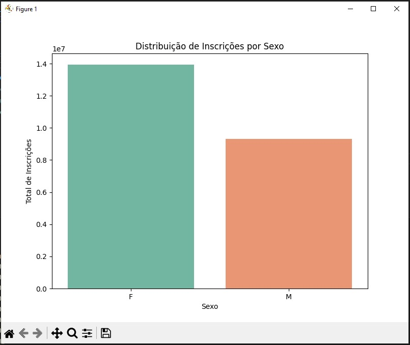

# Relatório de Análise Exploratória dos Dados do Exame Nacional do Ensino Médio (Enem)

## 📌 1. Compreensão do Problema e dos Dados

### 📝 Problema
O Enem é uma avaliação que mede o desempenho dos estudantes do ensino médio em diversas áreas do conhecimento, com foco na avaliação de conteúdos programáticos, habilidades e competências. Este projeto explora os dados do Enem, identificando padrões e gerando visualizações informativas entre 2018 e 2022.

### 🔍 Fonte dos Dados
Os dados foram extraídos da plataforma **Base dos Dados** e incluem:
- Ano.
- Sexo.
- Faixa Etária.

---

## 🛠️ 2. Pré-processamento e Limpeza de Dados

### 📂 Carregamento dos Dados
Os dados são carregados em blocos por meio da função `carregar_dados_em_blocos()` utilizando **Google BigQuery**. O processo é otimizado para grandes volumes com uma barra de progresso interativa.

### 🚩 Tratamento de Valores Ausentes
Valores ausentes foram tratados utilizando:
- **Média** para variáveis numéricas.
- **Moda** para variáveis categóricas.

### 🔄 Transformação de Variáveis
- Normalização e conversão de variáveis categóricas não estão implementadas neste projeto.

---

## 📈 3. Escolha de Técnicas Estatísticas

### 🔬 Técnicas Utilizadas
1. **Estatísticas descritivas:** Análise de métricas como média e dispersão.
2. **Visualizações de dados:** Exploração da distribuição de variáveis categóricas e tendências ao longo do tempo.

---

## 📊 4. Qualidade da Análise

### 📉 Visualizações
Os gráficos gerados incluem:
1. **Distribuição por sexo.**

3. **Distribuição por faixa etária.**
4. **Tendência no número de inscrições ao longo dos anos.**

### 🧠 Interpretação dos Resultados
Os gráficos oferecem insights sobre padrões demográficos e mudanças no número de inscrições ao longo do tempo.

---

## 🎨 5. Qualidade da Apresentação

### 🔎 Organização e Clareza
- O código é modular, com funções claras para cada etapa da análise.
- Visualizações utilizam cores intuitivas e eixos bem definidos.

### 🖼️ Qualidade dos Gráficos
As bibliotecas **Seaborn** e **Matplotlib** foram usadas para criar gráficos informativos e esteticamente agradáveis.

---

## 🖥️ 6. Uso do Python

### 📦 Ferramentas Utilizadas
- **pandas:** Manipulação e análise de dados.
- **numpy:** Suporte para cálculos matemáticos.
- **seaborn e matplotlib:** Criação de gráficos.
- **google.cloud.bigquery:** Conexão e consulta a dados armazenados na nuvem.

---

## 🏁 7. Conclusão

A análise fornece insights valiosos sobre o perfil dos inscritos no ENEM entre 2018 e 2022. As visualizações destacam:
1. **Distribuição demográfica:** Análise por sexo e faixa etária.
2. **Tendências temporais:** Variação no número de inscrições ao longo dos anos.
